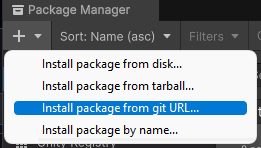

<h1 align="center">PKG</h1>

[](LICENSE.md)

Template Package

## Setup


### Requirement
- Unity 6000.0 or higher


### Install

1. Open the Package Manager from Window > Package Manager
2. "+" button > Add package from git URL
3. Enter the following to install

    * https://github.com/minnleee/pkg.git?path=Assets/Pkg

    * 

Or, open Packages/manifest.json and add the following to the dependencies block.

```json
{
    "dependencies": {
        "com.minn.pkg": "https://github.com/minnleee/pkg.git?path=Assets/Pkg"
    }
}
```

If you want to set the target version, specify it like follow.
* https://github.com/minnleee/pkg.git?path=Assets/Pkg#1.0.0
